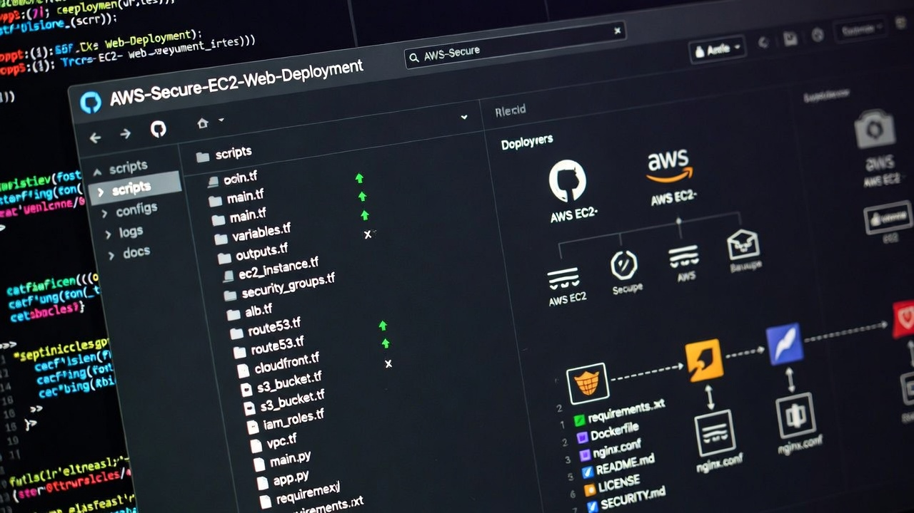
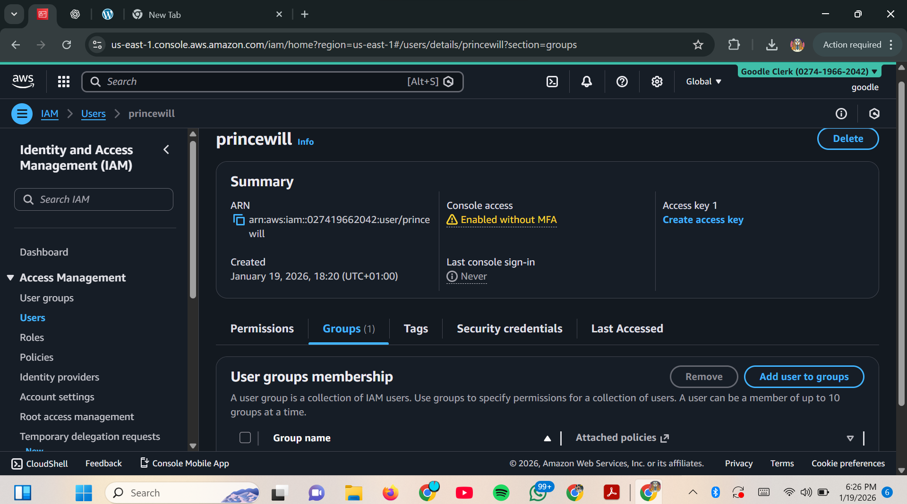
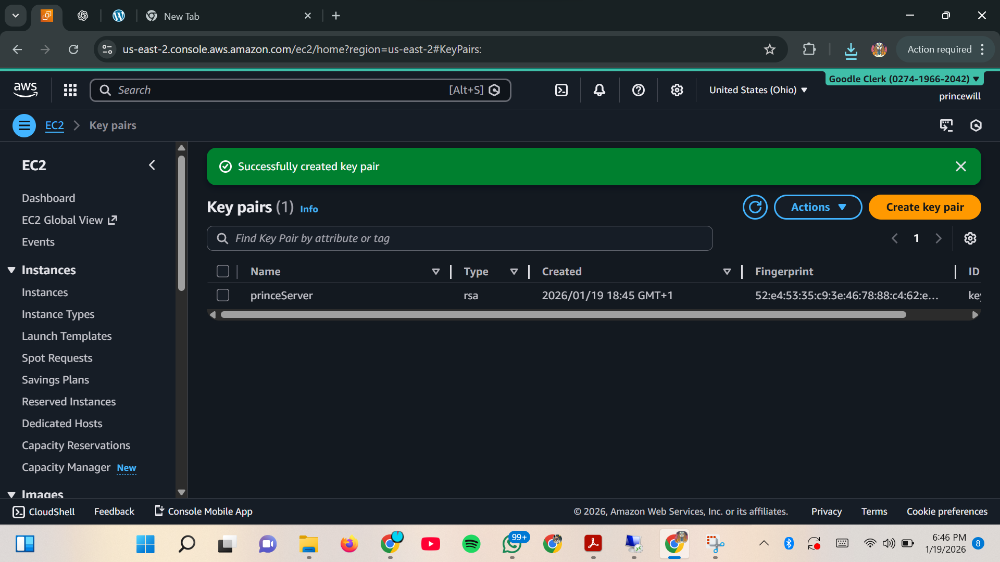
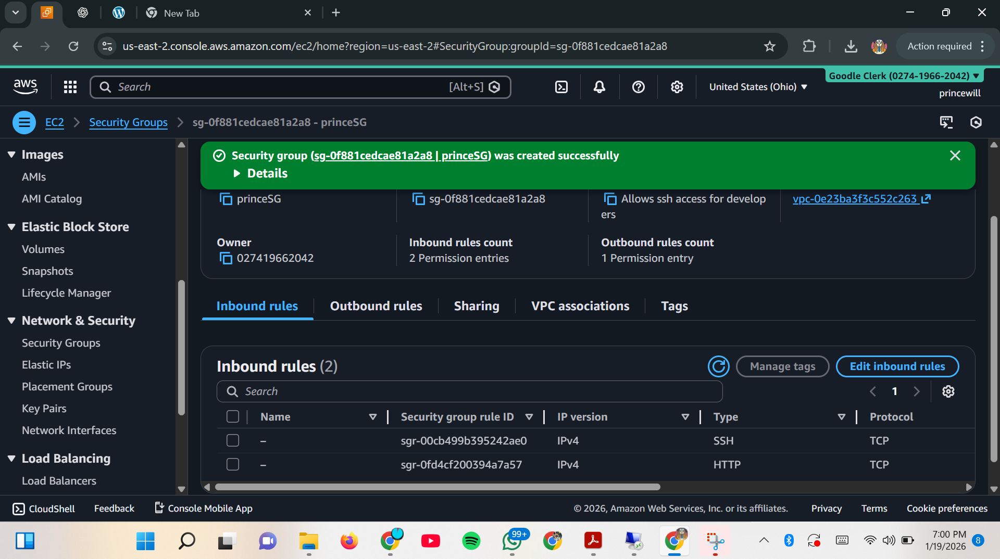
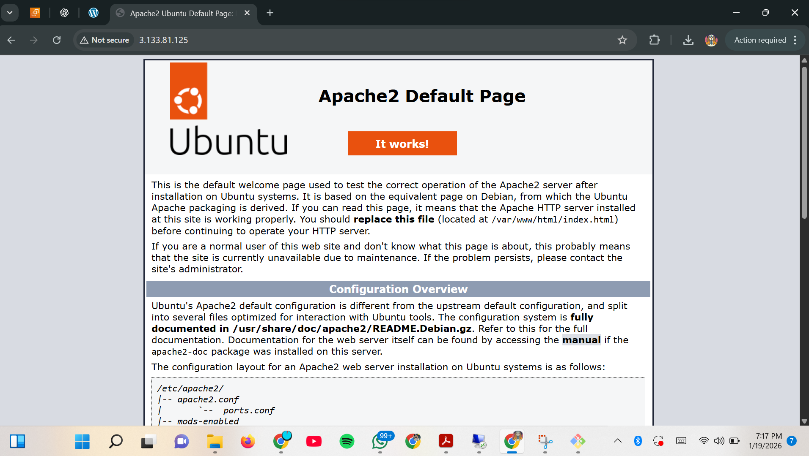
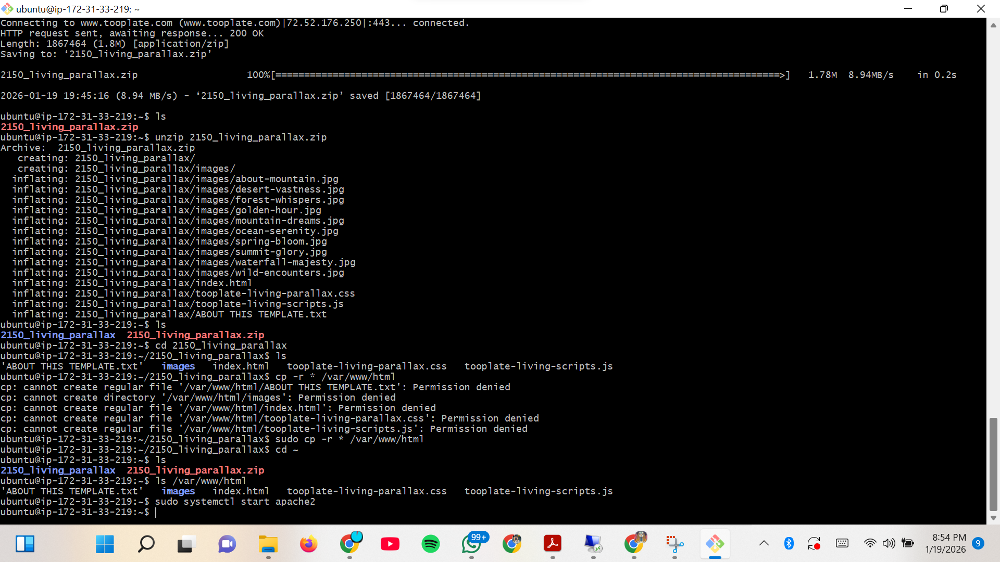
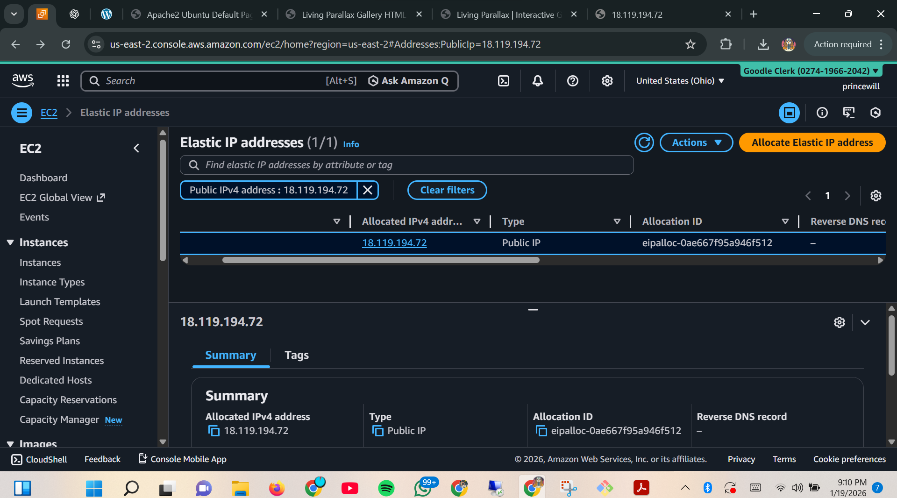
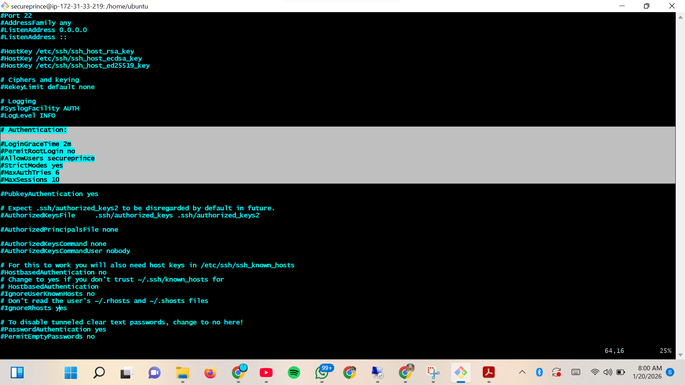

# Secure Static Website Deployment on AWS EC2


## Table of contents
- [Project Overview](#overview)
- [Architecture Explanation](#architecture)
- [Steps Taken](#steps-performed)
- [Security Configuration](#security-configuration-instructions)

---

## Overview
  This project demonstrates the secure deployment of a production-ready static website on Amazon Web Services (AWS) using an EC2 instance running Ubuntu 22.04.
  It follows cloud security best practices, including proper IAM usage, network hardening with security groups, key-based authentication, Elastic IP assignment, and basic Linux     server hardening.

---

## Architecture
```yaml
                 ┌──────────────────────────┐
                 │        IAM USER          │
                 │  (EC2-Admins Group)     │
                 │  - No Root Access       │
                 └───────────┬─────────────┘
                             │
                      AWS Console / CLI
                             │
                             v
┌──────────────┐     ┌─────────────────────────────┐
│   User PC    │────▶│   EC2 Instance (Ubuntu)     │
│ (SSH :22)    │     │   - t2.micro                │
│ (Key Pair)   │     │   - Security Group Firewall │
└──────┬───────┘     │   - Root Login Disabled     │
       │             │   - Sudo User Created       │
       │             └─────────────┬──────────────┘
       │                           │
       │                     Apache Web Server
       │                           │
       │                    /var/www/html
       │                           │
       │                     Static Website
       │                           │
       └───────────┐               v
                   │        Elastic IP (Public)
                   │               │
                   └──────────────▶│
                                   v
                            Internet Users
                         (HTTP Port 80 Open)

```
### ***Core Components:***
  - AWS IAM (Least-privilege access)
  - EC2 (t3.micro, Ubuntu 22.04)
  - Security Groups (Firewall rules)
  - SSH Key Pair (Secure access)
  - Elastic IP (Persistent public access)
  - Web Server (Apache)

---

## Steps Performed
***1. IAM Configuration***

  - Create an IAM group EC2-Admins.
  - Attach EC2 full access policy.
  - Create a user and added to the group.
  - Root account was never used for operations.


***2. Key Pair & Security Group***

  - Generate RSA key pair.
  - Configure inbound rules:
     ```bash
     SSH (22) → My public IP only
     HTTP (80) → 0.0.0.0/0
     ```
  - All other ports should be blocked.



***3. EC2 Deployment***

  - Launched Ubuntu 22.04 on t2.micro.
  - Attach key pair and security group.
  - Enabled public IP.


***4. Server Setup***

  ```bash
  sudo apt update
  sudo apt install apache2 -y 
  sudo systemctl start apache2
  ```

***5. Website Deployment***

  ```bash
  sudo rm -rf /var/www/html/*
  sudo unzip tooplate-template.zip -d /var/www/html/
  sudo chown -R www-data:www-data /var/www/html
  sudo chmod -R 755 /var/www/html
  ```


***6. Elastic IP***

  - Allocate an Elastic IP.
  - Associate it with EC2.
  - Reboot and confirm persistent access.


***7. Server Hardening***

 ```bash
  sudo adduser cloudadmin
  sudo usermod -aG sudo cloudadmin
  sudo nano /etc/ssh/sshd_config
  # Set: PermitRootLogin no
  sudo systemctl restart ssh
  ```


---

## Security Configuration Instructions

  - Never use the root account for daily operations or routine tasks.
  - Restrict SSH access to your personal IP address only.
  - Expose only the ports that are strictly required for the application or service.
  - Enforce key-based authentication for all SSH connections; disable password authentication.
  - Disable direct root login over SSH.
  - Create and use a separate, non-root user account with sudo privileges for all administrative work.
  - Assign and use an Elastic IP address to the instance to prevent public IP changes and avoid DNS drift.

---

## Author

Elochukwu Princewill

Cloud Computing • Cybersecurity 

---

## ⭐ If you found this project helpful

Feel free to ⭐ star this repository and explore my other AWS hands-on projects as I continue building practical cloud engineering solutions.

---


